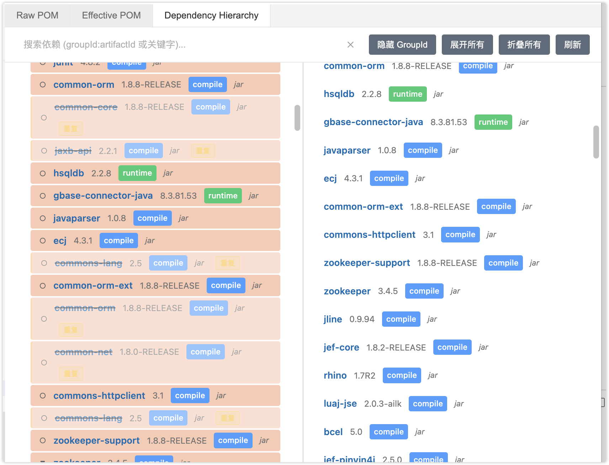
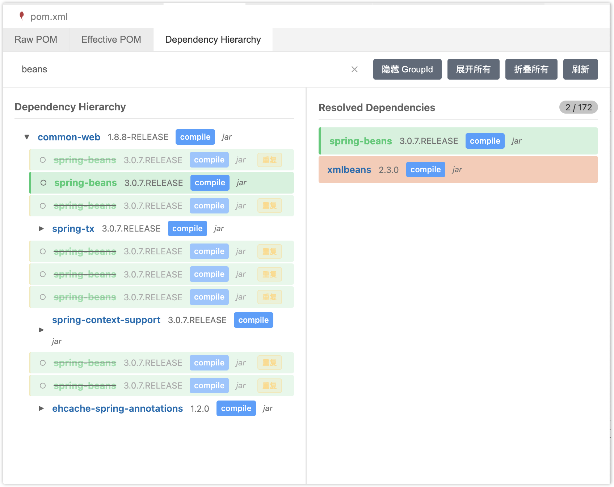

# Maven POM Editor

[](https://marketplace.visualstudio.com/items?itemName=Bokix.maven-pom-editor)
[](LICENSE)

一个 VS Code 扩展，专为 Maven 项目的 POM 文件提供可视化编辑和依赖管理功能。通过直观的界面查看依赖层次结构、快速排除冲突依赖，让 Maven 依赖管理变得简单高效。

## ✨ 功能特性

### 🎨 可视化编辑器
- **原始 POM 编辑器**: 基于 Monaco Editor 的 XML 编辑器，支持语法高亮、代码折叠、自动完成
- **Effective POM 查看**: 查看 Maven 解析后的完整配置，理解继承和属性替换的最终结果
- **实时保存**: 编辑内容自动同步到文件系统，无需手动保存

### 🔍 依赖管理
- **依赖层次可视化**: 树形展示项目的所有依赖关系及其传递依赖
- **依赖过滤**: 快速搜索和筛选特定的依赖项，支持 groupId、artifactId 和 version 搜索
- **冲突检测**: 自动识别并高亮显示版本冲突的依赖项
- **快速排除**: 通过右键菜单快速添加 exclusion 配置，解决依赖冲突

### 🚀 用户体验
- **自定义编辑器**: 为 `pom.xml` 文件提供专用的编辑界面
- **选项卡切换**: 在"原始 POM"、"Effective POM"和"依赖树"视图之间无缝切换
- **响应式界面**: 自适应布局，支持不同窗口大小

## 📸 功能展示

### 依赖层次可视化

*树形展示项目的所有依赖关系及其传递依赖，直观了解依赖结构*

### 依赖搜索与过滤

*快速搜索和定位特定的依赖项，支持实时过滤*

## 📦 安装

### 从 Marketplace 安装
1. 打开 VS Code
2. 按 `Ctrl+Shift+X` (Windows/Linux) 或 `Cmd+Shift+X` (macOS) 打开扩展面板
3. 搜索 "Maven POM Editor"
4. 点击 "安装"

### 从 VSIX 文件安装
```bash
code --install-extension maven-pom-editor-0.0.1.vsix
```

## 🎯 使用方法

### 方法 1：右键菜单
1. 在项目中打开任意 `pom.xml` 文件
2. 右键点击编辑器标签
3. 选择 "使用...重新打开编辑器" (Reopen Editor With...)
4. 选择 "Maven POM Editor"

### 方法 2：默认编辑器
1. 右键点击文件浏览器中的 `pom.xml` 文件
2. 选择 "打开方式..." (Open With...)
3. 选择 "Maven POM Editor"
4. （可选）勾选 "配置默认编辑器..." 将其设为默认

### 功能使用

#### 查看依赖树
1. 打开 POM 文件后，点击 "依赖树" 选项卡
2. 展开依赖节点查看传递依赖
3. 使用顶部搜索框过滤特定依赖

#### 排除依赖
1. 在依赖树中找到要排除的传递依赖
2. 右键点击该依赖
3. 选择 "排除此依赖" (Exclude Dependency)
4. 系统会自动在原始 POM 中添加 exclusion 配置

#### 查看 Effective POM
1. 点击 "Effective POM" 选项卡
2. 查看 Maven 解析后的完整配置
3. 使用搜索功能快速定位特定配置

## 📋 系统要求

### 必需
- **VS Code**: 1.80.0 或更高版本
- **Maven**: 本地安装 Maven 3.x 或更高版本（用于解析依赖信息）
- **操作系统**: Windows、macOS 或 Linux

### 推荐
- **Java**: JDK 8 或更高版本（Maven 运行所需）
- 将 Maven 添加到系统 PATH 环境变量

## ⚙️ 配置

暂无需额外配置，扩展会自动检测系统中的 Maven 安装。

## 🐛 已知问题

- 对于非常大的项目（超过 1000 个依赖），依赖树加载可能需要较长时间
- 在某些情况下，Maven 命令执行可能因权限问题失败
- 当前版本不支持多模块项目的聚合视图

如发现其他问题，请在 [GitHub Issues](https://github.com/bokix/maven-pom-editor.git/issues) 中报告。

## 🔄 版本历史

查看 [CHANGELOG.md](CHANGELOG.md) 了解详细的版本变更历史。

## 🤝 贡献

欢迎贡献代码、报告问题或提出建议！

1. Fork 本仓库
2. 创建特性分支 (`git checkout -b feature/AmazingFeature`)
3. 提交更改 (`git commit -m 'Add some AmazingFeature'`)
4. 推送到分支 (`git push origin feature/AmazingFeature`)
5. 开启 Pull Request

## 📄 许可证

本项目采用 MIT 许可证 - 查看 [LICENSE](LICENSE) 文件了解详情。

## 🙏 致谢

- [Monaco Editor](https://microsoft.github.io/monaco-editor/) - 强大的代码编辑器
- [VS Code Extension API](https://code.visualstudio.com/api) - 扩展开发框架
- [Maven](https://maven.apache.org/) - 项目依赖管理工具

## 📞 支持

- 🐛 [报告问题](https://github.com/bokix/maven-pom-editor.git/issues)
- 💬 [讨论区](https://github.com/bokix/maven-pom-editor.git/discussions)
- 📧 联系邮箱: bokix.sun@gmail.com

---

**享受使用 Maven POM Editor！** 如果觉得有用，请在 [Marketplace](https://marketplace.visualstudio.com/items?itemName=Bokix.maven-pom-editor) 上给我们⭐️评分！

